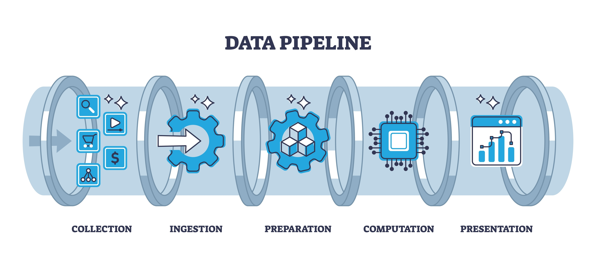
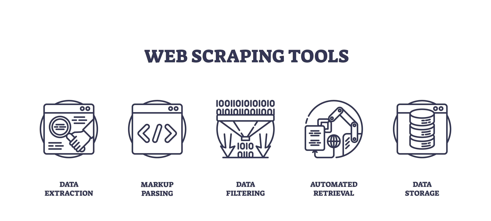
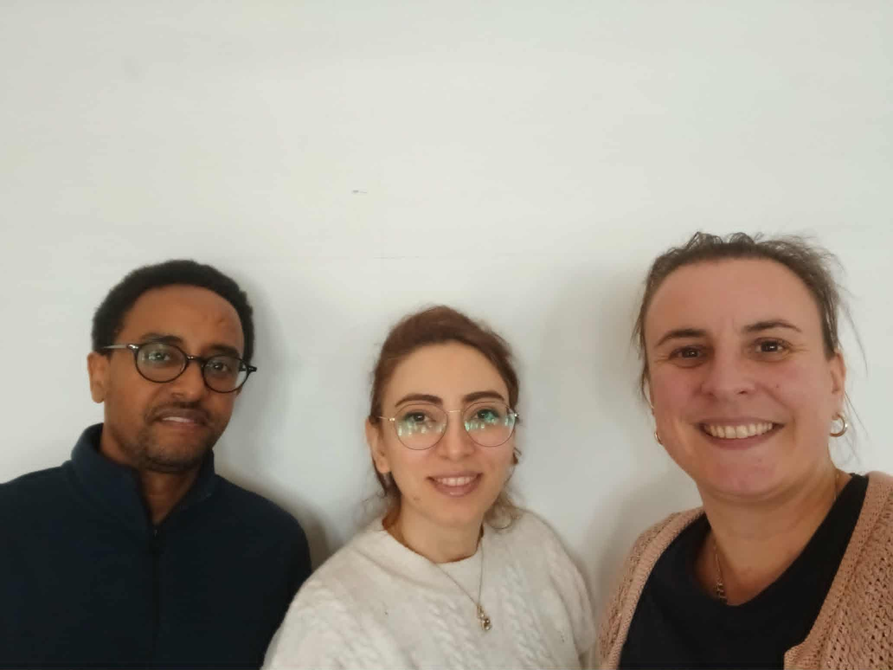

# Description of the Immo Eliza Data Collection

Immo Eliza aims to develop a machine learning model to predict real estate sale prices in Belgium. They have hired us — 
Hamideh, Welde, and Sandrine — to support the development of the entire project pipeline. 
In this initial phase, our focus will be on the first stage of the pipeline from the picture below: data collection through web scraping.

More specifically, web scraping will enable us to use a well-designed function to gather all the desired data from the selected real estate website.

.jpg)

The main objectives of this first part of the larger project are:
- Create 1 function that:
  1) scrapes all the desidered data from one real estate property displayed on www.immovlan.be,
  2) upscales the scraping to 10.000 properties across all Belgium,
  3) stores the data in an organized csv file.
- Collaborate in a team using Trello (www.trello.com)
- Use GitHub in a team setting (www.github.com)

to collect as much data as possible.

Our group’s strengths lie in regular updates, shared decision-making, a supportive work environment and efficient collaboration to achieve our objectives on time.

## Installation of the web scraper 

Web scraping is the process of automatically mining data or collecting information from the World Wide Web.

Several steps must be completed to develop a fully functional web scraper, as illustrated in the figure below.

1) First, we delineate the data we want to scrape. Our final dataset will be a `csv` file with the following data:
   

2) We created a GitHub repository called `immo-eliza-scraping`, with multiple branches, which will be made public at the end of the    
   project.
   This setup allows all team members to work on their local computers
   and push their changes when needed. Our team decided to merge all code into a single version before pushing to the main branch,
   in order to avoid conflicts during merging. Our regular oral updates should let us allow to win time for the seek of our project.

4) The repository contains the following files:
   - `scraper` folder with Python modules for scraping
   - `data` folder with the dataset 
   - `README.md` file
   - `main.py` file to run the scraper
   - `requirements.txt` file
   - `.gitignore` file
  
   We kept following must-haves in mind when writing our code: Missing information is initially encoded with `None`, whenever possible, we record only numerical values (for example, instead of defining
   whether the kitchen is equipped using `"Yes"` or `"No"`, we use binary values instead), we use appropriate and consistent column names for your variables (those will be key to training and understanding
   your model later on), no duplicates and no empty rows.

5) How did we write the code?

   

- We started small and tested often. Once we had tested our code for a few properties, we moved on to 10, 100, 1000,... etc. 
- We committed regularly and often.

# Usage of our Immo Eliza Web Scraper

This website scraper can be used to scrape a minimum of 10.000 properties and will be used in our data pipeline
for machine learning. 

# Sources used for the project

- https://www.selenium.dev/
- https://geckodriver.org/
- https://pandas.pydata.org/

# Visuals

- https://www.shutterstock.com/

# Contributors

We are Welederufeal Tadege, Hamideh Baggali and Sandrine Herbelet and are AI & Data Science trainees at Becode. 
We are all beginners in the field and are highly motivated.

# Timeline

# Who created this?

- https://www.linkedin.com/in/welederufeal-t-027907a5/
- https://www.linkedin.com/in/hamideh-be/
- https://www.linkedin.com/in/sandrineherbelet/ 

